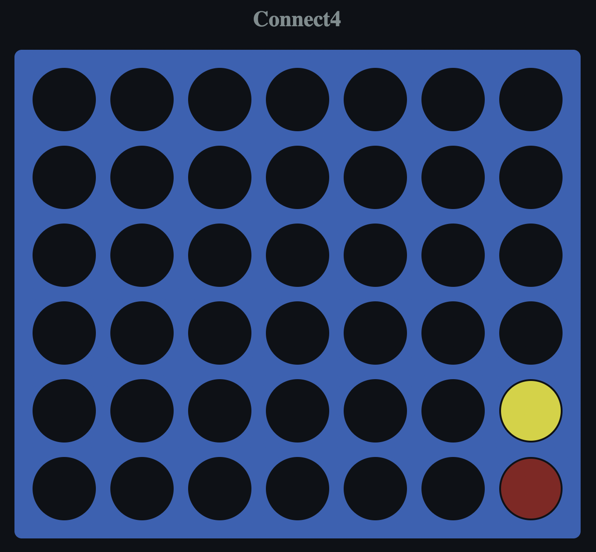

# 🚀 Connect4
> The Original game in JavaScript

## Installing / Getting started
```shell
Open with live server
```

### Technologies / Built With
- ✨ JavaScript
- 🍑 HTML
- 💅🏽 CSS

### Features
- 7 x 6 gameboard, 42 holes.
- Red piece start first, inmmediately later, yellow piece.
- That when clicking on a filled hole it is not modified.

### Next Steps
- Let the tiles fill in the holes by columns

